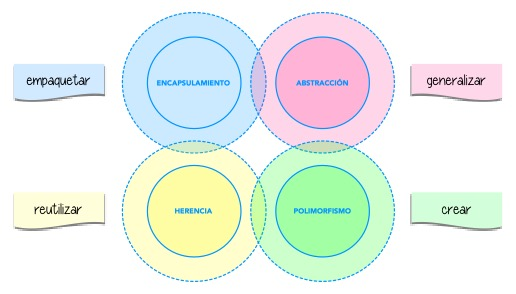

## Apuntes de Markdown
https://docs.github.com/es/get-started/writing-on-github/getting-started-with-writing-and-formatting-on-github/basic-writing-and-formatting-syntax

## Apuntes de programacion Orientada a Objetos
https://aprendepython.es/core/modularity/oop/

## Encalupsamiento
puedes guardar el codigo dentro de un lugar el cual se determina su comportomiento luego
## Abstracción
Permite simplificar el codigo a traves de clases
## Herencia
Puedes volver a llamar el codigo para rehusar el mismo comportamiento,etc
## Polimorfismo
Puedes nombrar multiples objectos a partir de una clase

### Diagram Class
https://mermaid.js.org/